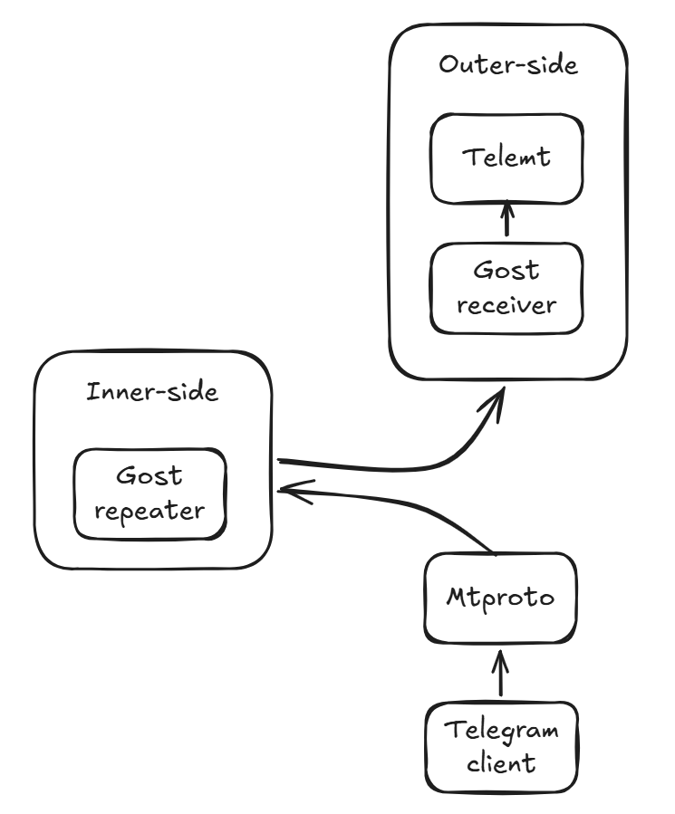
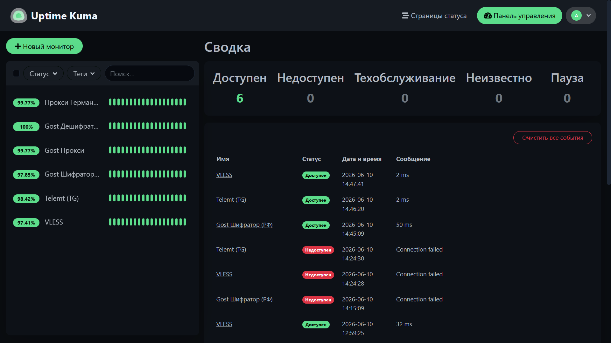

# Двухсерверная инфраструктура прокси и VPN

Репозиторий содержит готовую конфигурацию для развертывания отказоустойчивой, зашифрованной сетевой инфраструктуры обхода блокировок. Проект разделен на две части: **внутренний сервер** (мост внутри РФ) и **внешний сервер** .


## 🔨 Архитектура системы

### Основные компоненты и протоколы:

### Сам проект поделен на две части:
* Внутренняя для РФ **inner-side** - предназначена для стабильной работы mtproto прокси Teleram. Для ее работы требуется снимать дополнительный сервер в РФ или расположить локально на ПК. Выступает мостом между клиентом и самим прокси сервером. 
    > Вероятно, после обновления Mtproto командной Telegram, и изменения его паттернов поведения, необходимость во втором сервере исчезнет. 
* Зарубежная **outer-side** - часть проекта расположенная заграницей. Большинство технологий проекта расположенно на ней.

### Технологии используемые в сборке:
1. **VLESS-Reality (Xray):** Высокоскоростной VPN-протокол. Работает на стандартном порту `443` зарубежного сервера. Маскирует трафик под настоящее TLS 1.3 подключение к `www.microsoft.com`. Для работы требуется указать XRAY_PRIVATE_KEY и XRAY_CLIENT_ID в .env
2. **Telegram - Шифрованный мост MTProxy (Gost + Telemt):**
   * Клиент подключается к российскому IP inner-side на порт `9030`.
   * **Gost-bridge** на сервере в РФ принимает трафик, оборачивает его в шифрованный Shadowsocks-туннель и передает через границу РФ.
   * **Gost-receiver** расшифровывает поток и локально пересылает его в контейнер **Telemt**.
   * **Telemt** уже работает с Telegram трафиком и связывается с серверами Telegram.
   * Это защищает рукопожатие MTProxy от обнаружения по сигнатурам на международных стыках провайдеров.
3. **Классический прокси (Gost):** Традиционный HTTP/SOCKS5 прокси на порту `9000` с авторизацией по логину и паролю. Логин и пароль указываются в .env файле
4. **Мониторинг (Uptime Kuma):** Панель для контроля доступности всех сервисов с поддержкой оповещений в Telegram. Расположена на `9050` порту.

---

## 📁 Структура репозитория

```text
├── .gitignore
├── inner-side/                # Конфигурация для сервера внутри РФ (Москва)
│   ├── .env.example
│   └── docker-compose.yml
└── outer-side/                # Конфигурация для зарубежного сервера
    ├── .env.example
    ├── docker-compose.yml
    └── cfg/
        ├── telemt.toml        # Статические настройки MTProxy
        └── xray.template.json # Шаблон конфигурации Xray
```

---

### 🚀 Старт и развертывание

* Главная часть проекта - outer-side, является обязательной. 
* Inner-side ситуативен, актуален для РФ на  июнь 2026 года, поскольку без него Mtproto соединения почти всегда распознаются при переходе трафика в другую страну. Если обнаружение Mtproto усложнят в будущем, то inner-side можно не разворачивать и подключаться к outer-side напрямую.

### Итоговая схема подключения для Mtproto через inner-side


## Требования к серверам:


Два сервера с установленным Docker и Docker Compose.


* **РФ VPS**: Свободный порт 9030.
* **Зарубежный VPS**: 
Свободные порты 443, 9000, 9010, 9020, 9030, 9050.


## Шаг 1. Настройка и запуск РФ сервера

1. Перейдите в каталог inner-side/:
    ```bash
    cd inner-side/
    ```

2. Создайте файл переменных среды .env на основе примера:
    ```bash
    cp .env.example .env
    nano .env
    ```
3. Заполните переменные:
   - OUTER_SIDE_IP — публичный IP-адрес вашего зарубежного сервера.
   - OUTER_SIDE_PORT — укажите 9020 (порт, на котором зарубежный Gost принимает туннель).
   - GOST_PASSWORD — надежный пароль для шифрования межсерверного туннеля.

4. Запустите мост:
    ```bash
    docker compose up -d
    ```
## Шаг 2. Настройка и запуск зарубежного сервера
1. Перейдите в каталог outer-side/:
    ```bash
    cd outer-side/
    ```
2. Создайте файл переменных среды .env:
    ```bash
    cp .env.example .env
    nano .env
    ```
3. Заполните переменные:
   - PROXY_LOGIN — логин для общего HTTP/SOCKS5 прокси.
   - PROXY_PASSWORD — пароль для общего HTTP/SOCKS5 прокси.
   - GOST_PASSWORD — пароль для шифрования туннеля (должен строго совпадать с паролем на РФ сервере!).
   - XRAY_CLIENT_ID — уникальный UUIDv4 для авторизации VLESS-Reality. Сгенерировать новый можно командой: dbus-uuidgen или через Python.
   - XRAY_PRIVATE_KEY — приватный ключ Reality. Сгенерировать пару ключей можно через Docker-контейнер (см. раздел «Управление ключами»).

4. Запустите зарубежную часть инфраструктуры:
    ```
    docker compose up -d
    ```

🔐 Безопасность и управление ключами

Для генерации пары криптографических ключей X25519 для VLESS-Reality выполните команду внутри запущенного контейнера Xray:
```bash
docker compose exec xray xray x25519
```

Генерация Client Id:
```bash
docker compose exec xray xray uuid
```
Контейнер выдаст Private key и Public key.
* Private key и Client ID необходимо прописать в .env файл на сервере под переменной XRAY_PRIVATE_KEY и XRAY_CLIENT_ID соотвественно.
* Public key используется только на ваших устройствах в клиенте подключения (параметр pbk).

В Git отправляется только шаблон xray.template.json. Сам исполняемый файл config.json генерируется автоматически в скрытой папке cfg-generated/ при запуске контейнера.


## Подключение клиентов

### 1. Подключение к VLESS-Reality (Для телефонов и ПК)
Добавьте в ваш клиент (например, Hiddify, v2rayNG или Streisand) следующую ссылку, заменив <CLIENT_ID>, <ЗАРУБЕЖНЫЙ_IP> и <PUBLIC_KEY> на ваши данные:

```text
vless://<CLIENT_ID>@<ЗАРУБЕЖНЫЙ_IP>:443?security=reality&sni=www.microsoft.com&fp=chrome&pbk=<PUBLIC_KEY>&sid=2ebd6e17dec6a5d9&type=tcp&flow=xtls-rprx-vision#Xray-Reality
```
### 2. Подключение к Telegram MTProxy
Для подключения мессенджера к прокси используйте ссылку, которая выведится при запуске сервера:
``` Text
tg://proxy?server=<IP_СЕРВЕРА>&port=9030&secret=<SECRET>
```
* Ссылку Telemt выведет при запуске сервера, но там будет указан локальный IP адрес, его надо будет заменить (запуск с выводом в консоль - docker-compose up).
### 3. Подключение к общему HTTP/SOCKS5 прокси

Для использования в браузерных расширениях или прикладном софте:

* **Адрес:** `ЗАРУБЕЖНЫЙ_IP`
* **Порт:** `9000`
* **Тип:** `HTTP` или `SOCKS5`
* **Авторизация:** Ваши `PROXY_LOGIN` и `PROXY_PASSWORD`

### 4.📊 Мониторинг инфраструктуры

Панель мониторинга Uptime Kuma доступна по адресу:

```
http://<ЗАРУБЕЖНЫЙ_IP>:9050
```
При первом входе вам будет предложено выбрать базу данных (оставьте значение по умолчанию — SQLite) и создать учетную запись администратора. 

Из панели можно настроить отправку моментальных уведомлений в ваш Telegram-чат при падении любого из звеньев сети, для этого требуется создать бота через @BotFather и получить API ключ, он указывается в панели Uptime. Также возможна кастомизация сообщений о изменении статуса прокси различными эмодзи (премиумными тоже), шаблонами и тп.

### Пример настроенного Uptime Kuma

